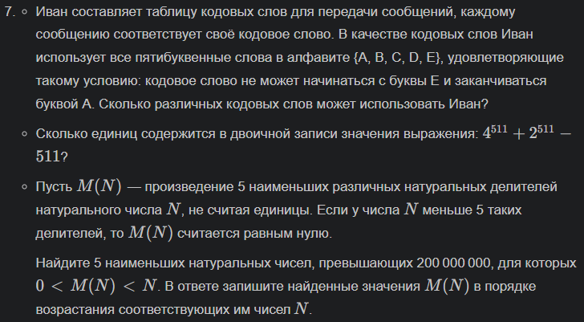
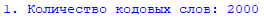
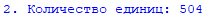
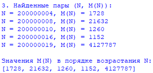

## Условия задач:

Задание 1 

## Условие задачи: 

## Описание проделанной работы 

Для решения задачи был использован язык программирования **Python**.

1. Список доступных букв: A, B, C, D, E.
2. На 1 позиции не может стоять буква E, а на последней - A. То есть на 1 и 5 позиции могут стоять только 4 разные буквы.
3. На остальных позициях может стоять любая из 5 букв.
4. Количество возможных вариантов комбинаций = 4 * 5 * 5 * 5 * 4.
5. Выводим полученное количество

## Скриншот результата

## Ссылки на используемые материалы

https://habr.com/ru/companies/otus/articles/529356/
https://docs.python.org/3/library/itertools.htmlhttps://proglib.io/p/iteriruemsya-pravilno-20-priemov-ispolzovaniya-v-python-modulya-itertools-2020-01-03

Задание 2 

## Описание проделанной работы 

Вычисляем значение выражения 

Переводим полученное число в двоичную систему с помощью встроенной функции bin()

Подсчитываем количество единиц в двоичной строке с помощью метода count('1')

Выводит результат на экран

## Скриншоты результатов 

## Ссылки на используемые материалы

https://habr.com/ru/companies/otus/articles/529356/
https://docs.python.org/3/library/itertools.htmlhttps://proglib.io/p/iteriruemsya-pravilno-20-priemov-ispolzovaniya-v-python-modulya-itertools-2020-01-03

Задание 3 

## Описание проделанной работы 

1. Анализ условия задачи

Из условия известно:

Показатель степени двойки должен быть чётным

Показатель степени тройки должен быть нечётным

Результат должен находиться в указанном диапазоне

2. Разработка алгоритма

Для решения задачи был разработан следующий алгоритм:

Создаётся пустой список для хранения результатов

Организуется перебор чётных значений для показателя степени двойки, начиная с нуля

Для каждого значения показателя двойки организуется перебор нечётных значений для показателя степени тройки, начиная с единицы

На каждой итерации вычисляется число как произведение двойки в соответствующей степени и тройки в соответствующей степени

Проверяется, попадает ли полученное число в заданный диапазон

Если число подходит, оно добавляется в список результатов

Перебор показателя тройки увеличивается на два, чтобы сохранять нечётность

Перебор показателя двойки также увеличивается на два, чтобы сохранять чётность

После завершения всех итераций список результатов сортируется по возрастанию

3. Реализация кода

Была написана функция, которая реализует описанный алгоритм. Внутри функции используются вложенные циклы для перебора показателей степеней. На каждом шаге вычисляется произведение и проверяется принадлежность диапазону. Подходящие числа накапливаются в списке, который после сортировки возвращается функцией.

4. Вывод результатов

После получения списка чисел программа выводит каждое число на отдельной строке для удобства чтения.

## Скриншоты результатов 

## Ссылки на используемые материалы

https://habr.com/ru/companies/otus/articles/529356/
https://docs.python.org/3/library/itertools.htmlhttps://proglib.io/p/iteriruemsya-pravilno-20-priemov-ispolzovaniya-v-python-modulya-itertools-2020-01-03
