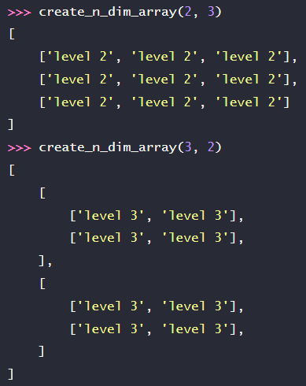
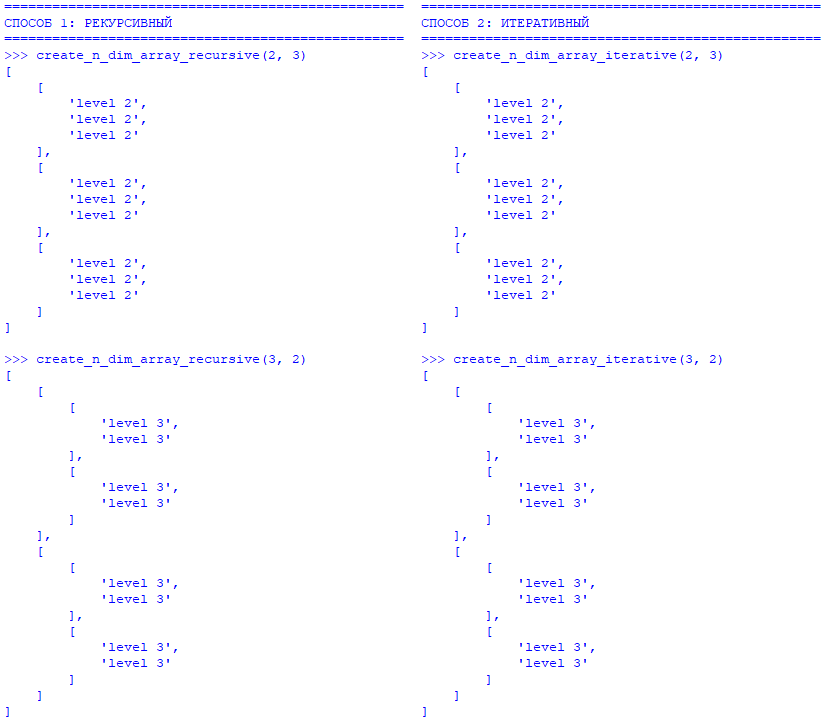
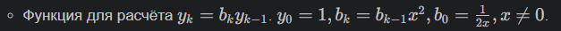
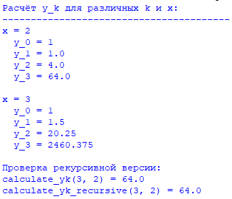

Задание 1 

## Условие задачи: 

1. Итеративная функция (без рекурсии)
Алгоритм:

Создаём начальное значение result = f'level {n}' — это будет самый глубокий элемент.

Повторяем n раз:

На каждом шаге заменяем result на новый список.

Этот список состоит из size копий текущего result.

После n повторений result становится n-мерным массивом.

2. Рекурсивная функция (с рекурсией)
Алгоритм:

Запоминаем исходное значение n (глубину вложенности), чтобы позже правильно подписывать элементы.

Если текущий уровень n == 1 — значит, мы дошли до самого глубокого уровня:

Создаём одномерный список (обычный список) из size элементов.

Каждый элемент — строка вида 'level X', где X — исходное значение n (например, 'level 3').

Если n > 1:

Создаём список из size элементов.

Каждый элемент этого списка — результат рекурсивного вызова create_n_dim_array_recursive с n - 1 (уходим на уровень глубже).

Возвращаем полученный многомерный список.

## Скриншоты результатов 

## Ссылки на используемые материалы

https://ru.wikipedia.org/wiki/Рекурсия_(программирование)
https://ru.wikipedia.org/wiki/Итерация_(программирование)

Задание 2

## Условие задачи: 

- Последовательно вычисляем значения от 4 до нужного индекса
- Храним только три последних значения (v_{i-3}, v_{i-2}, v_{i-1})
- На каждом шаге вычисляем новое значение по формуле
- Сдвигаем переменные для следующей итерации

## Описание проделанной работы 

1. Анализ задачи

Из условия известно:

y₀ = 1 — задано явно (начальное значение)

b₀ = 1/(2x) — задано явно (вспомогательная переменная)

Каждый следующий bₖ вычисляется через предыдущий: bₖ = bₖ₋₁ · x²

Каждый следующий yₖ вычисляется через текущий bₖ и предыдущий y: yₖ = bₖ · yₖ₋₁

2. Разработка итеративной функции

Алгоритм:

Проверка входа: Если x = 0 — ошибка (деление на ноль).

Инициализация:

y = 1 (это y₀)

b = 1 / (2 * x) (это b₀)

Цикл от 1 до k (для вычисления y₁, y₂, ..., yₖ):

Шаг A: b = b * x² (получаем b₁, затем b₂ и т.д.)

Шаг B: y = b * y (получаем y₁, затем y₂ и т.д.)

Вернуть полученное y (это и есть yₖ)

Пример для k=3, x=2:

Начало: y=1, b=1/(4)=0.25

i=1: b = 0.25×4=1.0; y = 1.0×1=1.0 (y₁)

i=2: b = 1.0×4=4.0; y = 4.0×1=4.0 (y₂)

i=3: b = 4.0×4=16.0; y = 16.0×4=64.0 (y₃)

Ответ: 64

3. Разработка рекурсивной функции

Рекурсивный подход заключается в определении функции через саму себя.

Алгоритм:

Использует вложенные рекурсивные функции:

compute_b(k) — рекурсивно вычисляет bₖ:

Если k == 0: вернуть 1/(2x)

Иначе: вернуть compute_b(k-1) × x²

compute_y(k) — рекурсивно вычисляет yₖ:

Если k == 0: вернуть 1

Иначе: вернуть compute_b(k) × compute_y(k-1)

Вызвать compute_y(k) и вернуть результат

## Скриншоты результатов

## Ссылки на используемые материалы

https://ru.wikipedia.org/wiki/Рекурсия_(программирование)
https://ru.wikipedia.org/wiki/Итерация_(программирование)
