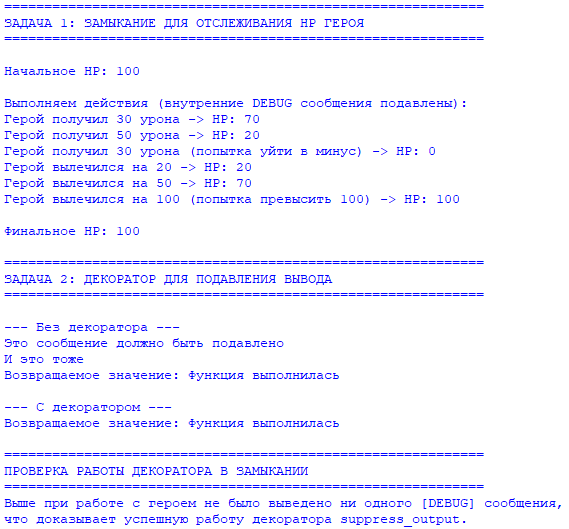

## Условие задачи: 

Замыкание для отслеживания количества HP героя - HP не может подниматься больше 100 и опускаться ниже 0, герой может лечиться или получать урон.
Декоратор для подавления вывода функции на консоль.

Решите обе задачи своего варианта.

Примените декоратор к замыканию.

## Описание проделанной работы 

Реализация замыкания: Была написана функция create_hero, которая принимает начальное значение HP и возвращает три вложенные функции: take_damage, heal и get_hp. Замыкание успешно захватывает переменную hp, позволяя изменять её состояние между вызовами. При этом реализована защита от выхода за границы диапазона (HP не может быть больше 100 или меньше 0) с помощью функций max и min.

Реализация декоратора: Был создан декоратор suppress_output. Он временно подменяет стандартный поток вывода sys.stdout на объект StringIO, который перехватывает все выводимые данные. После выполнения декорируемой функции оригинальный sys.stdout восстанавливается, а перехваченный вывод отбрасывается (не отображается в консоли).

Объединение логики: Декоратор suppress_output был применён к внутренним функциям take_damage и heal внутри замыкания. Это позволило скрыть от пользователя отладочные сообщения ([DEBUG] ...), которые генерируются в процессе изменения HP. При этом сам механизм замыкания продолжает корректно обновлять состояние HP, а внешний код получает только значимый результат — новое значение HP — через возвращаемое значение функций.

## Скриншоты результатов

## Ссылки на используемые материалы

https://www.google.com/search?q=https://docs.python.org/3/reference/executionmodel.html%23naming-and-binding

https://wiki.python.org/moin/PythonDecorators
